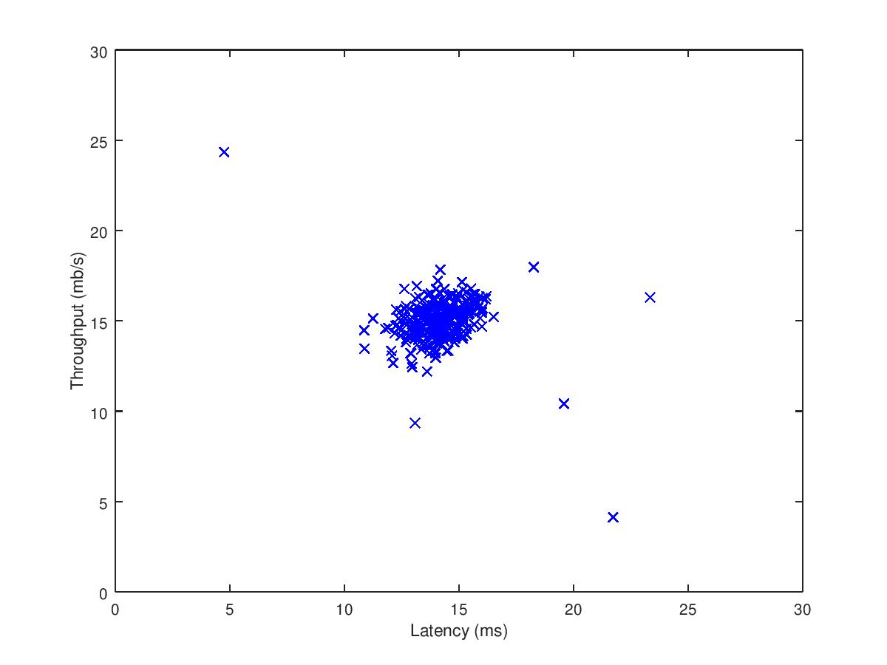
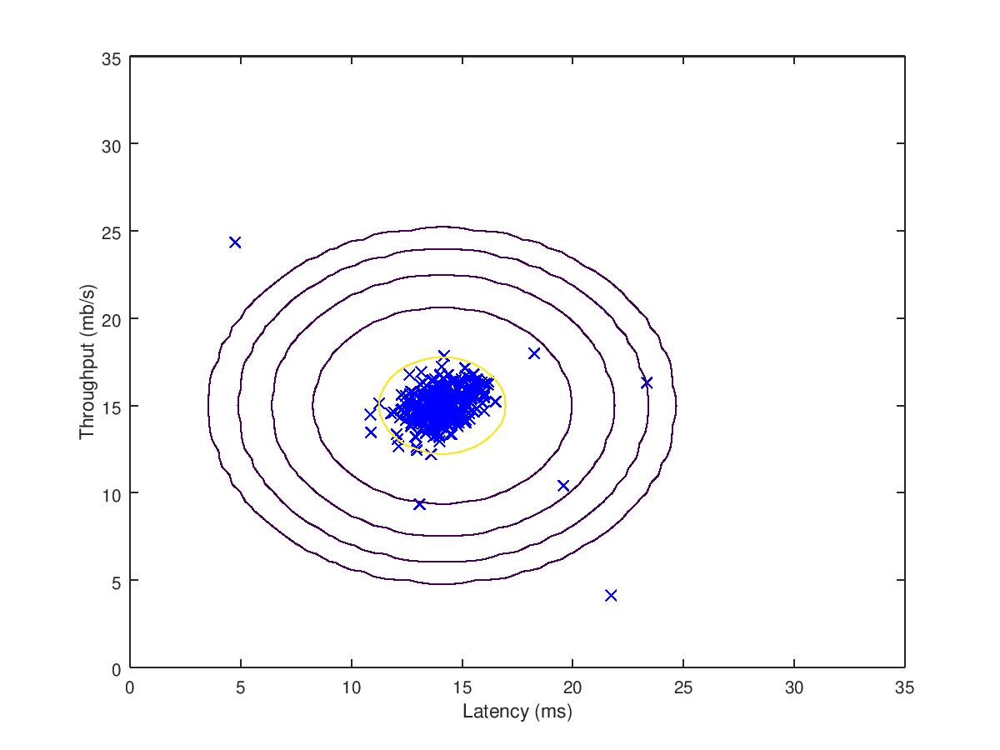
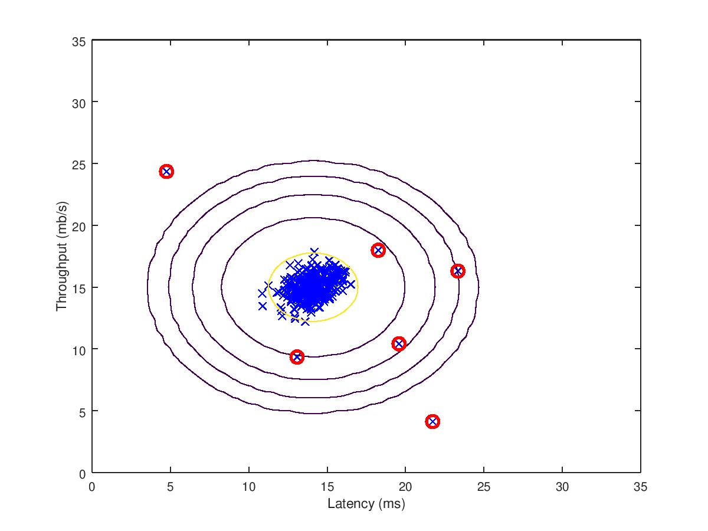

# anomaly-detection
Using an anomaly detection algorithm to detect anomalous behavior in server computers.
The features measure the throughput (mb/s) and latency (ms) of response for each server.

## Table of Contents
* [Setup](#setup)
* [Guassian distribution](#gaussian-distribution)
* [Estimating parameters for a Guassian](#estimating-parameters-for-a-guassian)
* [Selecting the threshold](#selecting-the-threshold)
* [High dimensional dataset](#high-dimensional-dataset)
* [To-Do List](#to\-do-list)

## Setup
We use a Guassian model to detect anomalous examples in the dataset. The dataset
is contained in **data/data1.mat**. We start on a
2D dataset for visualization purposes. We fit a Guassian distribution on the dataset and find values 
that have low probability and hence can be considered anomalities.
After that, we apply the anomaly detection algorithm to a larger datset
with many dimensions. Below is the visualization of the 2D dataset. 


## Gaussian distribution
Suppose we have ```m``` examples in our dataset and
```n``` features in each example.
We need to fit a Guassian distribution on the dataset.
Given a training set ``` X ``` ,an ```m x n``` matrix.
we want to estimate the Guassian distribution for each feature
```X(:, i)```. For each feature ```X(:, i)```, we need to find
parameters ```mu(i)``` and ```Sigma2(i)``` that fits the data
in the ith dimension ```X(:,i)```, where ```mu``` is the mean
vector and ```Sigma2``` is the variance vector.

## Estimating Parameters for a Guassian
We estimate ```mu(i)``` by:
```octave
mu(i) = (1/m) * sum(X(:, i));
```
and for the variance:
```octave
Sigma2(i) = (1/m) * sum( ( X(:, i) - mu(i) ) ^ 2)
```
but we can also use a more efficient, vectorized implementation
```octave
mu = mean(X);
Sigma2 = var(X,1);
```
in **src/estimateGuassian.m**.
The script in **tests/visualizeGuassian.m** plots the contours of the
fitted Guassian distribution.

The yellow contour indicates a probability of 0.01 and each consecutive
contour line is 1000 times smaller than the inner one.

## Selecting the Threshold
After estimating the Guassian parameters, we can estimate the probability 
of each example in the script **src/multivariateGuassian.m** which returns
a *m x 1* vector ```pval``` of the probabilities for each training example.
Since low probability examples are more likely to be
anomalies, we select a threshold based on a cross validation set. 

The function in **src/selectThreshold.m** takes in the cross validation vector
of values (0 for normal, 1 for anomally) ```yval``` and ```pval``` to compute
the best threshold ```bestEpsilon``` and the best *F<sub>1</sub>* score ```bestF1```.

The script in **tests/findOutliers.m** runs the functions above to find the outliers
and plot them (shown below).


## High Dimensional Dataset
In practice, datasets will have more than just 2 dimensions. **data/data2.mat** contains
a dataset with 11 features. The script in **tests/highDimensionalDataset.m** will estimate the
Guassian parameters, evaluate the probabilties for the training data and then use the
cross-validation set to find the best epsilon. 

## To-Do List
- [X] add figure of dataset
- [X] implement src/estimateGuassian.m
- [X] implement tests/visualizeGuassian.m
- [X] add figure 2 for Guassian distribution contour
- [X] selecting the threshold
  - [X] implement src/selectThreshold.m
  - [X] add figure for outliers
- [ ] high dimensional dataset
  - [ ] implement tests/highDimensionalDataset.m
  - [ ] show results
- [ ] README.md tweaks
  - [ ] details for *F<sub>1</sub>* score computation
  - [ ] vectorized implementations for *F<sub>1</sub>* score
